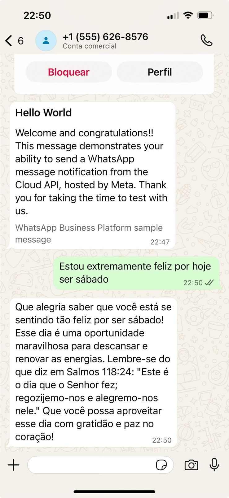

# WhatsApp AI Helper

A FastAPI-based WhatsApp assistant that provides empathetic, Christian-inspired responses to text and audio messages using OpenAI's GPT and Whisper models. The bot can reply with both text and audio, always including a Bible verse in its responses.





## Features

- Receives WhatsApp messages (text and audio) via webhook.
- Uses OpenAI GPT to generate empathetic, Christian responses.
- Transcribes incoming audio messages using OpenAI Whisper.
- Converts AI responses to audio using OpenAI TTS and sends them back to WhatsApp.
- Includes a CLI for local testing and a test server for development.

## Project Structure

```
.
├── config.py
├── server.py
├── requirements.txt
├── .env.example
├── tools/
│   └── answer.py
├── prompts/
│   └── gentle_christian.py
├── development/
│   ├── cli.py
│   ├── server_test.py
│   └── server_request.py
└── audio_responses/
```

## Setup

1. **Clone the repository**

2. **Install dependencies**
   ```sh
   pip install -r requirements.txt
   ```

3. **Configure environment variables**

   Copy `.env.example` to `.env` and fill in your credentials:
   ```
   OPENAI_API_KEY="your-openai-key"
   WHATSAPP_TOKEN="your-whatsapp-token"
   WHATSAPP_PHONE_ID="your-whatsapp-phone-id"
   NGROK_URL="your-ngrok-url"
   ```

4. **Run the server**
   ```sh
   uvicorn server:app --reload
   ```

## Development

- **CLI Test:**  
  Run `python development/cli.py` for a local prompt/response loop.

- **Webhook Test Server:**  
  Run `uvicorn development.server_test:app --reload` to test webhook logic without WhatsApp.

- **Send Test Request:**  
  Use `python development/server_request.py` to send a sample webhook payload.

## How it Works

- Incoming WhatsApp messages trigger the `/webhook` endpoint in [`server.py`](server.py).
- Text messages are processed directly; audio messages are transcribed first.
- The AI response is generated using [`tools.answer.ai_answer`](tools/answer.py), which uses a prompt from [`prompts.gentle_christian.prompt`](prompts/gentle_christian.py).
- Responses are sent back to the user as text or audio.
